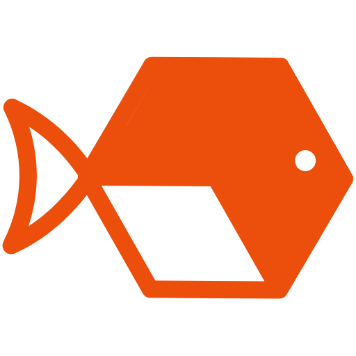

<h1 align="center">
  
     
  <b>Anabas Labs </b>
</h1>

<h3 align="center">
  Anabas Labs is a software engineering studio dedicated to building scalable, real-world systems for startups and enterprises. We specialize in designing robust web platforms, intuitive mobile applications, and streamlined DevOps infrastructure that ensures your product performs consistently. Beyond standard development, we integrate AI-driven automation to optimize workflows and future-proof your operations. Our approach combines deep technical expertise with a focus on long-term maintainability, delivering solutions that rely less on quick fixes and more on engineering excellence.
</h3>

<h3 align="center">
  <a href="https://anabaslabs.com"><b><code>anabaslabs.com</code></b></a>
</h3>

  
  
  
  
  
  
  

